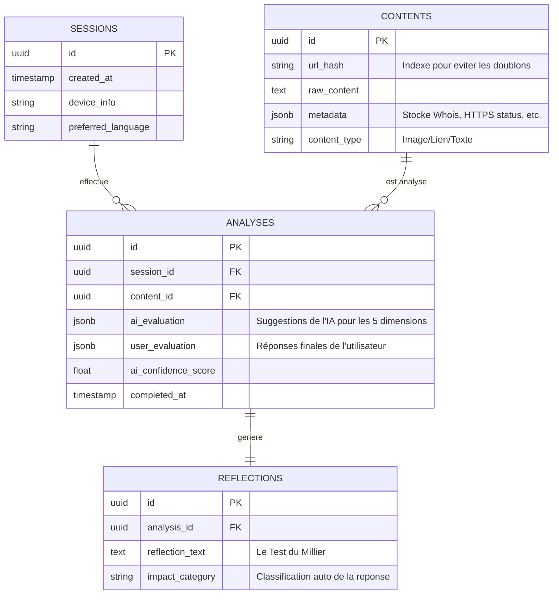

---

# DOCUMENT : `SENIOR_DATABASE_SCHEMA.md`
**Projet :** Media Compass (UNESCO Hackathon 2026)  
**Expertise :** Data Model Senior (Information Structure Architect)  
**Statut :** V1 - SCHÉMA RELATIONNEL (SUPABASE/POSTGRESQL)

---

## 1. PHILOSOPHIE DU MODÈLE : "AUDITABILITÉ ET ANONYMAT"
Le schéma est conçu pour :
1.  **Respecter la vie privée :** Pas de données personnelles identifiables (PII), uniquement des sessions anonymes.
2.  **Tracer l'apprentissage :** Stocker l'écart entre la proposition de l'IA et la décision finale de l'utilisateur pour mesurer l'évolution de l'esprit critique.
3.  **Performance :** Optimisé pour des lectures rapides sur mobile.

---

## 2. DIAGRAMME ENTITÉ-RELATION (ERD)



---

## 3. DICTIONNAIRE DE DONNÉES (EXTRAIT)

### 3.1 Table `ANALYSES` (Le cœur du système)
Cette table est cruciale pour l'**Explicabilité de l'IA**.
*   **`ai_evaluation` (JSONB) :** Stocke les raisons techniques.
    *   *Structure :* `{"source": {"status": "warning", "reason": "Domaine récent"}, "intent": {...}}`
*   **`user_evaluation` (JSONB) :** Stocke si l'utilisateur a validé ou corrigé l'IA.
    *   *Utilité :* Permet de prouver au jury que l'humain reste au centre (Human-in-the-loop).

### 3.2 Table `REFLECTIONS`
*   **`reflection_text` :** La réponse à la question "Si 10 000 jeunes partagent...". 
    *   *Analyse :* Ces données pourront être utilisées (anonymement) pour créer des rapports sur la perception de la désinformation par la jeunesse en RDC.

---

## 4. ÉBAUCHE DE SCRIPT DDL (POSTGRESQL)

```sql
-- Creation de la table des contenus analyses
CREATE TABLE contents (
    id UUID PRIMARY KEY DEFAULT gen_random_uuid(),
    url_hash TEXT UNIQUE,
    raw_content TEXT,
    metadata JSONB DEFAULT '{}'::jsonb,
    content_type TEXT CHECK (content_type IN ('url', 'image', 'text')),
    created_at TIMESTAMPTZ DEFAULT NOW()
);

-- Creation de la table principale des analyses
CREATE TABLE analyses (
    id UUID PRIMARY KEY DEFAULT gen_random_uuid(),
    session_id UUID NOT NULL,
    content_id UUID REFERENCES contents(id),
    ai_evaluation JSONB NOT NULL,
    user_evaluation JSONB,
    ai_confidence_score FLOAT,
    completed_at TIMESTAMPTZ DEFAULT NOW()
);

-- Index pour la performance des statistiques
CREATE INDEX idx_analyses_confidence ON analyses(ai_confidence_score);
```

---

