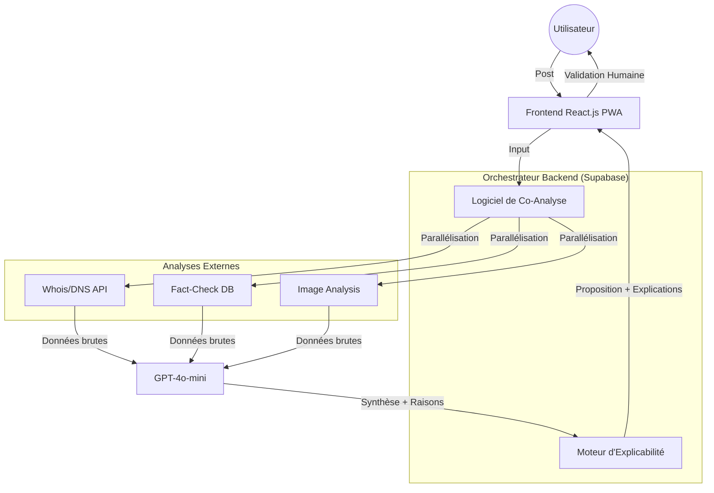

```mermaid

    graph TD
    User((Utilisateur))
    App[Frontend React.js PWA]
    
    subgraph "Orchestrateur Backend (Supabase)"
        Handler[Logiciel de Co-Analyse]
        XAI[Moteur d'Explicabilité]
    end

    subgraph "Analyses Externes"
        DNS[Whois/DNS API]
        Fact[Fact-Check DB]
        Vision[Image Analysis]
    end

    LLM[GPT-4o-mini]

    User -->|Post| App
    App -->|Input| Handler
    Handler -->|Parallélisation| DNS & Fact & Vision
    DNS & Fact & Vision -->|Données brutes| LLM
    LLM -->|Synthèse + Raisons| XAI
    XAI -->|Proposition + Explications| App
    App -->|Validation Humaine| User
```