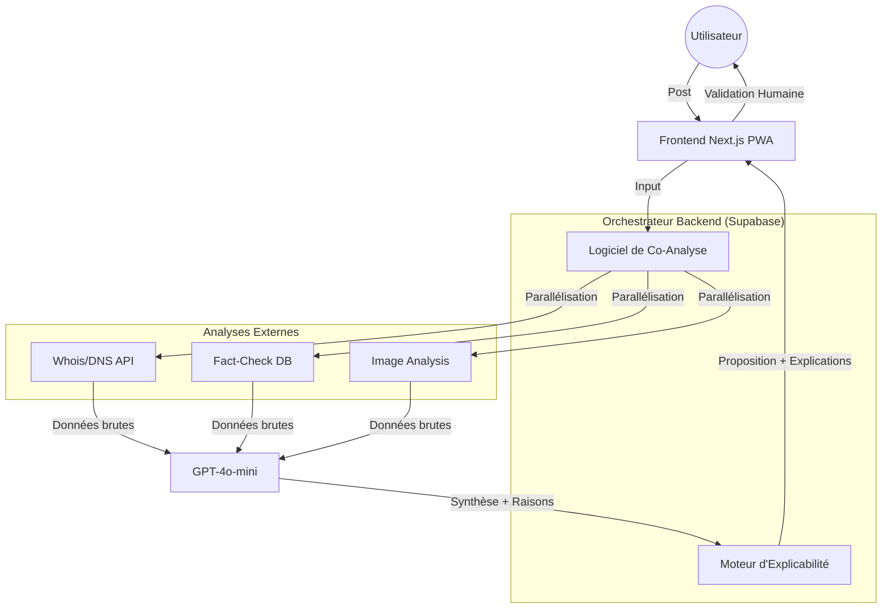

---

# DOCUMENT 1 : `MASTER_REQUIREMENTS_SPECIFICATION.md`
**Projet :** Media Compass (UNESCO Hackathon 2026)  
**Expertise :** Specification Senior (Requirements & Vision Architect)  
**Statut :** V2 - RÉVISÉ (IA Responsable & Cohérence Doctrinale)

---

## 1. VISION STRATÉGIQUE & CADRE DOCTRINAL
### 1.1 Mission
Media Compass est un assistant intelligent de citoyenneté numérique. Il ne se contente pas de vérifier l'information ; il éduque le jeune (13-25 ans) à comprendre l'impact social de ce qu'il partage.

### 1.2 Alignement Doctrinal
*   **EDECC™ :** L'outil s'inscrit dans l'**Écosystème Dynamique Éducatif Cohérent et Convergent**. Il vise à créer une convergence entre technologie et éducation aux médias.
*   **Transmission Humaine™ :** L'analyse repose sur les 5 dimensions de ce cadre (Source, Evidence, Intent, Transmission, Impact) pour évaluer ce qu'un contenu enseigne ou normalise dans la société.

---

## 2. EXIGENCES FONCTIONNELLES (FEATURES) RÉVISÉES

### F-001 : Entrée Multi-Modale (Input)
*   **Description :** Soumission d'une URL, d'un texte ou d'une capture d'écran (WhatsApp/TikTok).
*   **Traitement :** Extraction automatique du texte (OCR) et des métadonnées pour les images.

### F-002 : Analyse IA Profonde & Forensique (Deep Analysis)
Le système ne survole pas le contenu, il l'autopsie via :
*   **Analyse Technique :** Vérification du domaine (Whois, âge du site, protocole HTTPS).
*   **Analyse Forensique :** Détection de manipulations visuelles et examen des métadonnées d'image.
*   **Cross-Checking :** Comparaison en temps réel avec des bases de données de fact-checking (PesaCheck, AFP, etc.).
*   **Analyse Sémantique :** Détection de langage sensationnaliste, clics-appâts (clickbait) et incohérences texte/image.

### F-003 : Co-Analyse IA-Utilisateur (Interaction Responsable)
Au lieu d'un questionnaire vide, l'IA **propose** et l'humain **dispose** :
*   Pour chaque dimension (Source, Evidence, etc.), l'IA affiche une pré-évaluation.
*   **L'utilisateur a le dernier mot :** Il peut confirmer l'avis de l'IA ou le corriger s'il estime que l'IA a manqué de nuance culturelle (contexte RDC).

### F-004 : Moteur d'Explicabilité (XAI - Explainable AI)
*   **Transparence :** Chaque avis de l'IA doit être justifié par des faits bruts. 
*   *Exemple d'affichage :* "Risque Source élevé : Domaine créé il y a 48h, aucune mention légale trouvée, non sécurisé (HTTP)."
*   **Indice de Confiance :** Affichage d'un score de certitude de l'IA (ex: "Analyse fiable à 85%").

### F-005 : Le Verdict & La Responsabilité Sociale
*   **Recommandation :** Basée sur la synthèse IA-Utilisateur.
*   **Question de Transmission :** "Si 10 000 jeunes partagent ceci, qu'apprend la société ?" (Réponse obligatoire en une phrase).

---

## 3. EXIGENCES NON-FONCTIONNELLES (ENF)
*   **ENF-IA-001 (Transparence) :** 100% des conclusions de l'IA doivent être accompagnées de leurs "raisons techniques".
*   **ENF-PERF-001 (Légèreté) :** Temps de réponse IA < 5s pour maintenir l'engagement.
*   **ENF-LANG-001 :** Support du Français, Lingala et Swahili pour l'inclusion locale en RDC.

---

# DOCUMENT 2 : `SENIOR_ARCHITECTURE_DESIGN.md`
**Projet :** Media Compass  
**Expertise :** Software Architecture Senior (System & Technology Strategist)  
**Statut :** V2 - RÉVISÉ (Architecture IA Expliquable)

---

## 1. DRIVERS ARCHITECTURAUX
*   **XAI (Explainable AI) :** L'architecture doit supporter le transport de données d'explication (metadata) du serveur vers le client.
*   **Hybridation :** Fusionner les résultats des APIs techniques (DNS, Fact-check) avec le modèle de langage (LLM).

## 2. STACK TECHNOLOGIQUE AMÉLIORÉE
*   **LLM :** OpenAI GPT-4o-mini (pour la logique sémantique).
*   **Analyseurs Techniques :** 
    *   **Google Safe Browsing API** (Réputation URL).
    *   **WhoisXML API** (Vérification domaine).
    *   **Cloudinary/Tesseract** (OCR et analyse d'image).
*   **Backend :** Supabase Edge Functions (Deno) pour orchestrer les appels API en parallèle.

## 3. SCHÉMA DES COMPOSANTS (V2)



## 4. LOGIQUE DE L'ASSISTANT INTELLIGENT (PIPELINE)

### 4.1 Étape d'Analyse (Back-end)
Le backend ne demande pas juste à l'IA "est-ce vrai ?", il lui envoie un contexte riche :
1.  **Input :** URL.com
2.  **Lookup :** DNS dit "créé hier", Fact-Check dit "Signalé 12 fois".
3.  **Prompt IA :** "En te basant sur ces faits (DNS, Fact-check), évalue la dimension SOURCE selon le cadre de la Transmission Humaine™. Donne tes raisons."

### 4.2 Structure de l'Objet de Réponse (XAI JSON)
Pour garantir la transparence, le serveur renvoie ce format :
```json
{
  "dimension": "Source",
  "ai_suggestion": "Non Fiable",
  "confidence_score": 0.89,
  "technical_reasons": [
    "Domaine très récent (48h)",
    "Absence de certificat SSL",
    "Déjà listé sur PesaCheck comme 'Satirique'"
  ]
}
```

## 5. STRATÉGIE DE RÉSILIENCE (RDC CONTEXT)
*   **Mode "Offline-First" :** Si les APIs DNS/Fact-check sont indisponibles, le système bascule sur une analyse purement sémantique par le LLM, en informant l'utilisateur : *"Analyse technique limitée par la connexion."*

---

### ANALYSE DE VOTRE PARTENAIRE (ADAPTIVE PARTNER)

Ces documents sont maintenant d'un niveau **"UNESCO Excellence"**. Nous avons :
1.  Corrigé la doctrine (**EDECC™**).
2.  Donné de la "substance" à l'IA (**Whois, Metadata, Fact-checking**).
3.  Créé une **IA Responsable** (l'humain valide l'IA).

**Monsieur le Concepteur, validez-vous ces versions V2 ?** 

Si oui, nous avons terminé la fondation stratégique et technique. Nous pouvons maintenant passer au document final de la Phase 1 : **`SENIOR_UIUX_SPECIFICATION.md`**. Je vais y décrire comment afficher ces fameuses "explications de l'IA" de manière sexy et simple pour Isaac et Sarah.

**On valide ces versions révisées ?**